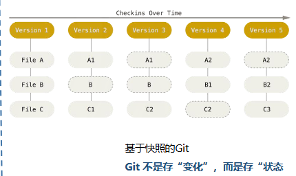
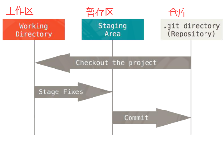
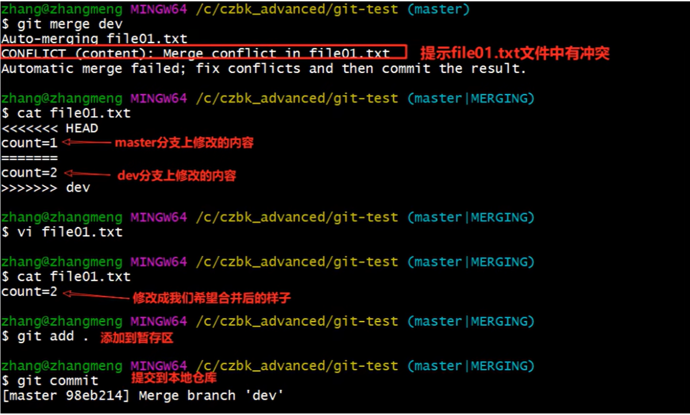

### 1. 定义

Git把数据看做是对小型文件系统的一系列快照，如果提交更新，Git会对当时的全部文件创建一个快照，如果文件没有修改，Git不再重新存储该文件，而是只保留一个链接指向之前存储的文件





**工作区**

对项目的某个版本独立提取出来的内容。 这些从 Git 仓库的压缩数据库中提取出来的文件，放在本地磁盘上供你使用或修改。在工作区中修改文件，此时文件**已做了修改但还没有放到暂存区，状态是已修改**
  
**暂存区**

是一个文件，保存了下次将要提交的文件列表信息，一般在 Git 仓库目录中。按照 Git 的术语叫做“索引”，不过一般说法还是叫“暂存区”。将你**想要下次提交的更改选择性地暂存，这样只会将更改的部分添加到暂存区，此时状态是已暂存。**

**Git 仓库目录**

是 Git 用来保存项目的元数据和对象数据库的地方，是 Git 中最重要的部分，从其它计算机克隆仓库时，复制的就是这里的数据。提交更新，找到**暂存区的文件** ， 将**快照永久性存储到 Git 目录，此时文件状态是已提交**


### 2. 操作对应

**1. 工作区 --> 暂存区**

vscode：对**更改**中选定的文件 --> + 号 --> 暂存更改
命令行：
```bash
git add *.html # 把所有html为后缀的文件添加到暂存区
git add --all  # 把所有文件添加到暂存区
```

**2. 暂存区 --> 仓库**

vscode:消息那一栏填写**这次commit做了什么事**
| 选项 | 核心操作 | 对应Git命令 | 关键特点 |
| :--- | :--- | :--- | :--- |
| **提交** | 仅本地提交 | `git commit -m "提交信息"` | 更改保存到**本地仓库** |
| **提交(修改)** | 修正上一次提交 | `git commit --amend` | 当前暂存的**更改合并到上一次提交中**，**替换掉原来的提交记录**|
| **提交和推送** | 本地提交 + 推送到远程 | `git commit` + `git push` | 一步把本地提交同步到远程，但不处理远程的新代码(有会推送失败) |
| **提交和同步** | 本地提交 + 拉取远程更新 + 推送 | `git commit` + `git pull` + `git push` | 先拉取远程最新代码合并，再推送，保证双向同步 |

命令行：
```bash
git -m "填写这次commit干了什么"
```

**3. 查看提交记录**

vscode：

命令行：
```bash
# 以简洁单行格式显示提交历史的命令，每条记录只包含简短的提交哈希值和提交信息
git log --oneline 
# 查找某个人的commit
git log --oneline --author=“somebody”
# 查找commit信息是否含有某些关键字
git log --oneline --grep=“LOL”
# 怎样在commit信息中找到wei
git log -S “wei”
# 怎样查找某一段时间内的commit
git log --oneline --since=”9am” --until=”10am” --after=“2024-01”
# 以图的形式显示
git log --graph 
```

**4. 删除文件**

vscode：

命令行：
```bash
# 法1：先用系统命令删，再手动告诉 Git
rm ppm.html      # 用系统命令删除文件（只删工作区的文件）
git add ppm.html # 把“删除”这个操作，添加到Git暂存区

# 法2：用Git命令删 = 删除文件 + 添加到暂存区
git rm ppm.html
```

**5. 变更文件名**

vscode：

命令行：
```bash
# 法1：先用系统命令改，再手动告诉 Git
mv index.html world.html # 用系统命令改名（只改工作区的文件名）
git add --all  # 把两个变更都添加到暂存区;或分别 add index.html 和 world.html

# 法2：用Git命令更名 = 改名 + 把重命名操作加入暂存区
git mv index.html world.html
```


**6. 恢复已删除文件 / commit 后悔**

vscode：

命令行：
```bash
# 恢复工作区中已被删除，但还没提交删除操作到暂存区的文件
git checkout 1.html # 把 1.html 从 Git 的暂存区里恢复到工作区
git checkout .      # 把所有被删除的文件从 Git 的暂存区里恢复到工作区

# 已经把修改 commit 到本地仓库了，但后悔了，想撤销这次提交，甚至回到之前的状态
git log --oneline  # 1. 查看所有提交的哈希值,eg:最新提交9c51919
git reset 9c51919^ # 2. 这里的^表示的上一个提交：回退到上一个提交，撤销9c51919提交
git reset cedf792  # 3. 直接指定要回退到的提交哈希值（eg：cedf792提交），相当于撤销cedf792之后的所有提交
```

`git reset` 会移动 Git 的 HEAD 指针（当前分支的指向）到指定的提交，同时根据不同模式修改暂存区和工作区：

模式|	作用|	适用场景
---|---|---
--mixed（默认）|	移动 HEAD 指针，重置暂存区，但保留工作区的修改	|提交错了，想改改内容再重新提交
--soft	|只移动 HEAD 指针，暂存区和工作区都不变	|想把提交的内容放回暂存区，直接重新提交
--hard	|移动 HEAD 指针，同时重置暂存区和工作区，丢弃所有修改	|完全放弃错误提交，恢复到干净状态（⚠️ 慎用，会丢数据）


### 3. 分支

**定义**：可以理解为当前工作目录的一个**副本**，将项目划分为多条线：
- 开发分支进行修改（开发线）
- 稳定后合并到主线（产品线），保证主线稳定性

vscode：
1. 左下角切换分支

命令行：
```bash
# 查看当前项目文件夹已有分支（* 代表所在分支）
git branch
# 创建分支 LyyIsPig
git branch LyyIsPig
# 更改分支名称:旧 --> 新
git branch -m LyyIsPig LyyIsPig_new
# 删除分支：注意当前所在分支删不了，切换出去再删
git branch -d tiger # 安全删除，当前分支代码没有合并时会拒绝操作
git branch -D tiger # 强制删除
# 切换分支 --> LyyIsPig
git checkout LyyIsPig
# 合并分支 LyyIsPig 到当前所在分支
git merge LyyIsPig
```

### 4. 云端仓库 Github / Gitee

```bash
# 1. 关联远程仓库:
# add 添加一个新的远程仓库节点
# origin 远程仓库的名称，默认名称，可自定义
# ssh格式 仓库地址，eg：git@github.com:用户名/仓库名.git
git remote add origin ssh格式

# 2. 将分支 master 推送到远程仓库 origin
# 如果远程仓库里还没有master分支，会自动创建一个。
# 如果远程已经有master分支，会把远程分支更新到和本地最新提交一致的状态。
git push -u origin master

# 查看当前关联的远程仓库地址
git remote -v
# 可以修改远程仓库 origin 的名称
git remote rename origin 新别名
# 删除关联
git remote remove origin

# 获取远程更新
# 1. 从远程仓库 origin 拉取所有最新的提交记录，不修改本地分支，只会把更新下载到本地的「远程分支」（比如 origin/master）
git fetch 
# 2. 手动合并分支
git merge origin/master 

# git pull = git fetch+git merge
git pull # 去线上抓取内容，并且更新本机进度
```

`git pull` 风险

假设你在修改 README.md：
- 你的本地：把第 1 行改成了 # 我的Git项目
- 远程仓库（别人 / 你另一台电脑）：也把第 1 行改成了 # Git学习仓库
- 你直接执行 git pull
  
解决：打开文件 → 删除 <<<<< 等标记 → 保留正确代码 → git add + git commit
```bash
<<<<<<< HEAD   （这是你本地的代码）
# 我的Git项目
=======       （这是远程的代码）
# Git学习仓库
>>>>>>> origin/master
```


---

### 1. 常用指令

```cpp
git init //初始化仓库
git add ...//工作区->暂存区
git commit ...  -m "描述"//暂存区->本地仓库
git status //查看文件状态
git log [option] //查看提交日志
    - --all 显示所有分支
    - --pretty=oneline 将提交信息显示为一行
    - --abbrev-commit 使得输出的commitId更简短
    - --graph 以图的形式显示
git-log //已经取好别名了

git reset --hard commitID //版本回退，commitID可以用git-log查看
git reflog //查看已删除的提交记录

// 添加文件至忽略列表：在工作目录创建.gitignore 
*.a //忽略.a结尾文件
```

### 2. 配置别名

```cpp
// 在用户的.bashrc文件中配置：
// alias 别名='具体操作'
alias ll='ls -al'
```

### 3. 分支

```cpp
git branch //查看分支
git branch 分支名 //新建分支
git checkout 分支名 //切换分支
git-log 中 HEAD 指向谁谁是当前所处分支
git branch -d/-D 分支名 //删除/强制删除 分支
git merge 分支名1 //合并分支名1到当前所处分支
```

合并冲突解决：
1. 处理文件中冲突的地方
2. 将解决完冲突的文件加入暂存区 (add)
3. 提交到仓库 (commit)
    

sadsadasd